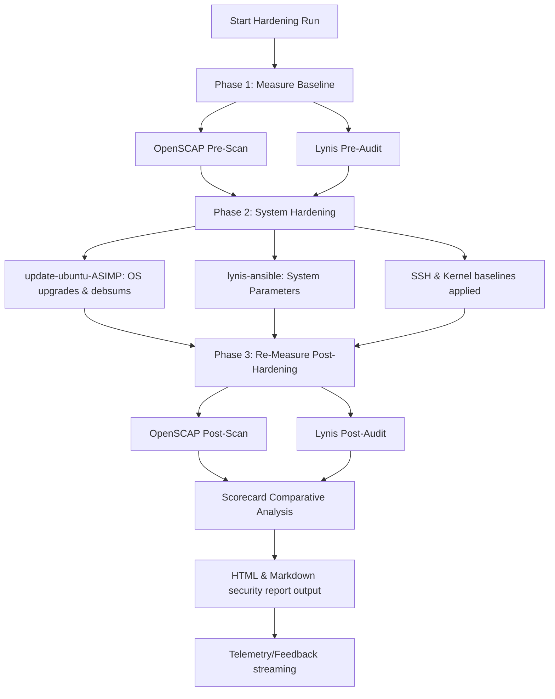

# System Architecture & Security Posture

ASIMP (Ansible System Integrity Management Platform) is designed around a zero-trust, self-observing host-security framework. It implements a rigorous **"Measure, Harden, Re-Measure"** pipeline powered by Ansible, OpenSCAP, and Lynis.

---

## 🏛️ ASIMP Security Pillars

1. **Dual-Engine Audit Pipeline**: Co-orchestrates OpenSCAP (CIS Level 2 compliance scanning) and Lynis (localized Unix system hardening profiling).
2. **Standardized OS Hardening**: Standardizes kernel configuration settings, SSH security parameters, and limits unprivileged user access vectors.
3. **Integrity Validation with `debsums`**: Continuously verifies local package structures against pristine MD5 checksum databases.

---

## 🗺️ Architectural Workflow Flow

The system orchestrates operations across three distinct execution phases, represented in the Mermaid flow below:

---

## 🔒 Unprivileged Sandbox Compatibility (Google Jules Mode)

When system-level privileges are constrained (such as running inside containerized, unprivileged Google Jules sandboxes):

- **Environment Detection**: The system detects sandbox mode by evaluating `$USER` / `$LOGNAME` equal to `jules` (or checking `/home/jules` existence) and testing whether `/etc/sysctl.conf` is unwritable/restricted, setting the `is_sandbox_jules: true` fact.
- **Role Integration vs. Standalone Script**:
  - **Ansible `reporting-ASIMP` Role**: During playbook runs, the role automatically bypasses live package installs and writes mock comparative scorecards directly into `data/asimp_mock/opt/report/openscap/`.
  - **Standalone `tools/mock-asimp.sh` Utility**: Can be invoked directly as a standalone shell script in unprivileged CLI environments. It checks environment variables (`IS_JULES_MOCK` or `$USER == "jules"`) and Populates identical mock scorecards and report files under `data/asimp_mock/`.
- **Safety Scaling**: Sets `asimp_privilege_level: 'limited'`, skipping heavy package upgrades and kernel-level sysctl manipulations that would fail under unprivileged container namespaces.
